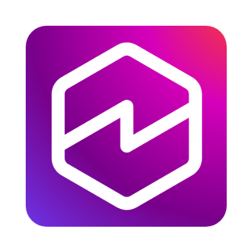

<div align="center">
  <div>
    <a href="https://aws.amazon.com/quick/">
      
   </a>
  </div>

  <h1>
      Amazon Quick Knowledge Hub
  </h1>

  <div align="center">
    <a href="https://github.com/aws-samples/sample-amazon-quick-suite-knowledge-hub/graphs/commit-activity"></a>
    <a href="https://github.com/aws-samples/sample-amazon-quick-suite-knowledge-hub/issues"></a>
    <a href="https://github.com/aws-samples/sample-amazon-quick-suite-knowledge-hub/pulls"></a>
    <a href="https://github.com/aws-samples/sample-amazon-quick-suite-knowledge-hub/blob/main/LICENSE"></a>
  </div>
</div>

## What is this?

This is the knowledge hub for [Amazon Quick](https://aws.amazon.com/quick/). It contains integration guides, infrastructure-as-code templates, management documentation, and end-to-end use cases maintained by the Amazon Quick team. The content is published as a searchable documentation site and supplements the [official Amazon Quick documentation](https://docs.aws.amazon.com/quick/latest/userguide/).

**Read the docs here: [aws-samples.github.io/sample-amazon-quick-suite-knowledge-hub](https://aws-samples.github.io/sample-amazon-quick-suite-knowledge-hub/)**

## What's in it?

The [Integration](https://aws-samples.github.io/sample-amazon-quick-suite-knowledge-hub/integration/) section covers how to connect third-party services to Amazon Quick as knowledge base sources and action connectors, including MCP server implementations you can deploy directly.

The [Manage Quick](https://aws-samples.github.io/sample-amazon-quick-suite-knowledge-hub/manage-quick/) section covers identity configuration, observability (CloudWatch-based monitoring via MCP), customization, and security guardrails.

The [Infrastructure as Code](https://aws-samples.github.io/sample-amazon-quick-suite-knowledge-hub/infrastructure-as-code/) section provides a Terraform module for bootstrapping Amazon Quick with AWS IAM Identity Center.

The [Amazon Quick on desktop](https://aws-samples.github.io/sample-amazon-quick-suite-knowledge-hub/amazon-quick-on-desktop/) section provides a CDK stack that deploys Amazon Cognito as an OpenID Connect (OIDC) provider for the desktop application.

The [Use Cases](https://aws-samples.github.io/sample-amazon-quick-suite-knowledge-hub/use-cases/) section contains complete, deployable solutions ranging from actuarial analysis with MCP tools and chat agent embedding in web apps to document generation via AgentCore, compliance automation, and exporting SharePoint lists to Amazon Quick Sight datasets.

## Local development

The site is built with [MkDocs Material](https://squidfunk.github.io/mkdocs-material/) and managed with `uv`. To run it locally:

```bash
pip install uv
uv sync --dev
uv run mkdocs serve
```

The site is available at `http://127.0.0.1:8000`. Changes to files in `docs/` are reflected immediately.

## Contributing

See [How to Contribute](docs/HOW-TO-CONTRIBUTE.md) for the full guide. Fork the repo, add your content under `docs/`, update the nav in `mkdocs.yml`, run `uv run mkdocs build --strict` to verify, and open a PR.

## License

This project is licensed under the MIT-0 License. See the [LICENSE](LICENSE) file.

## Contributors

<a href="https://github.com/aws-samples/sample-amazon-quick-suite-knowledge-hub/graphs/contributors">
  
</a>
